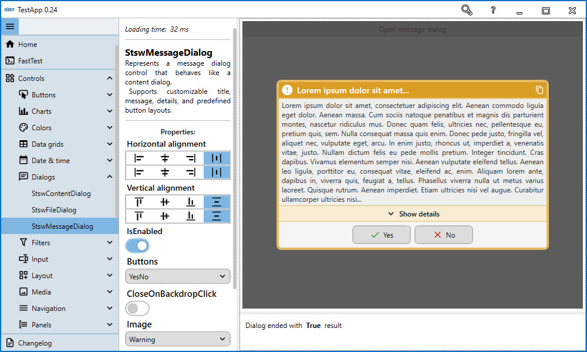
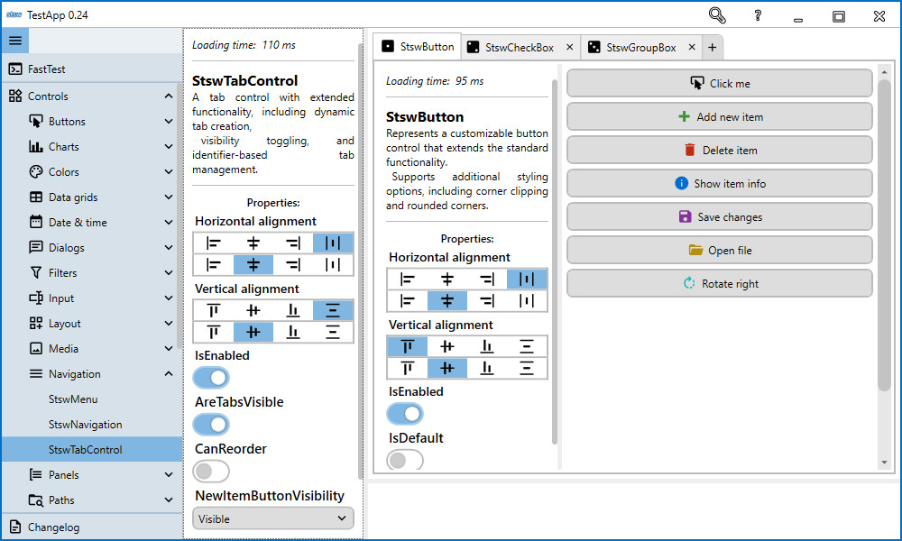
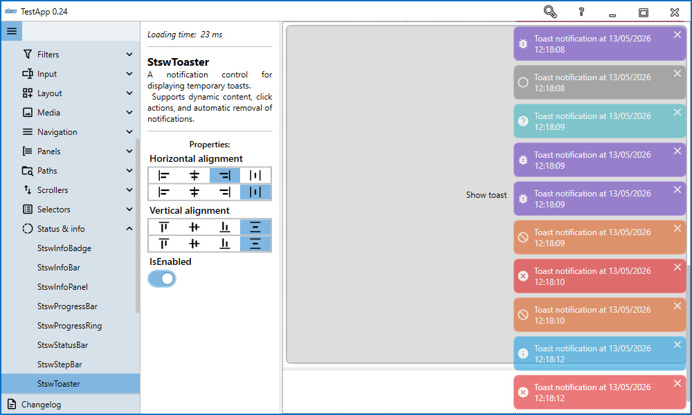

# Identifier-Based Controls in StswExpress (WPF)

Several StswExpress WPF controls expose an `Identifier` property together with static helper methods. The identifier lets a caller locate a loaded control instance without holding a direct reference to it.



## Core rule

Treat `Identifier` as a routing key for a specific loaded host/control instance.

Recommended conventions:

- use explicit values such as `"MainDialogHost"`, `"ShellNavigation"`, or `"TrayIcon.Main"`,
- keep identifiers unique among loaded instances of the same control type,
- include window/module context when the application can open multiple similar windows,
- centralize string constants to avoid typo-related runtime failures.

```csharp
public static class UiIdentifiers
{
    public const string MainDialogHost = "MainDialogHost";
    public const string ShellNavigation = "ShellNavigation";
    public const string MainTabs = "MainTabs";
    public const string MainTrayIcon = "TrayIcon.Main";
    public const string MainToaster = "MainToaster";
}
```

## `StswContentDialog`

Place a dialog host in the visual tree:

```xml
<se:StswContentDialog Identifier="MainDialogHost" />
```

Then show arbitrary content through that host:

```csharp
var result = await StswContentDialog.Show(
    new MyDialogContent(),
    UiIdentifiers.MainDialogHost);
```

Close it with an optional result value:

```csharp
StswContentDialog.Close(UiIdentifiers.MainDialogHost);
StswContentDialog.Close(UiIdentifiers.MainDialogHost, resultValue);
```

The host must already be loaded when the static call is made.

## `StswMessageDialog`

`StswMessageDialog.Show` accepts the host identifier directly. You do not create and pass a `StswMessageDialog` instance to the static method.

```csharp
var result = await StswMessageDialog.Show(
    message: "Are you sure you want to delete this item?",
    title: "Delete item",
    buttons: StswDialogButtons.YesNo,
    image: StswDialogImage.Warning,
    identifier: UiIdentifiers.MainDialogHost);
```

There is also an overload for exceptions:

```csharp
await StswMessageDialog.Show(
    exception,
    "Unhandled exception",
    UiIdentifiers.MainDialogHost);
```

## `StswNavigation`

Give the navigation control a stable identifier:

```xml
<se:StswNavigation Identifier="ShellNavigation" />
```

The current static navigation API is `SetContent`:

```csharp
StswNavigation.SetContent(
    typeof(DashboardView),
    createNewInstance: false,
    identifier: UiIdentifiers.ShellNavigation);
```

The `context` argument can be a `Type`, a registered type name, or an object instance. When `createNewInstance` is `false`, the control can reuse an already cached context for the same key.

## `StswTabControl`

`StswTabControl` exposes a static `Add` helper that locates the target tab control by identifier:

```xml
<se:StswTabControl Identifier="MainTabs" />
```

```csharp
var newTab = StswTabControl.Add(UiIdentifiers.MainTabs);
```

The returned `StswTabItem` can then be customized by the caller.



## `StswNotifyIcon`

A tray icon can also be located by identifier:

```xml
<se:StswNotifyIcon Identifier="TrayIcon.Main" />
```

The static method is `Show`:

```csharp
using System.Windows.Forms;

StswNotifyIcon.Show(
    "Sync complete",
    "All files are up to date.",
    ToolTipIcon.Info,
    UiIdentifiers.MainTrayIcon);
```

## `StswToaster`

When an application has multiple toaster regions, use an identifier to select the target instance:

```xml
<se:StswToaster Identifier="MainToaster" />
```

```csharp
StswToaster.Show(
    StswDialogImage.Information,
    "Saved successfully.",
    identifier: UiIdentifiers.MainToaster);
```



## `StswFileDialog`

`StswFileDialog.Show` also accepts an optional host identifier:

```csharp
var path = await StswFileDialog.Show(
    initialPath: @"C:\Data",
    filter: "Text files|*.txt",
    identifier: UiIdentifiers.MainDialogHost);
```

## Common mistakes

1. **No matching loaded instance**  
   A static call cannot find the requested control if it has not been loaded yet or the identifier does not match.

2. **Duplicate identifiers**  
   Identifier lookup throws when multiple viable loaded controls match the same identifier. Keep identifiers unique for a given control type and runtime scope.

3. **String typos**  
   Prefer shared constants rather than repeating identifier literals across the application.

4. **Wrong window/module**  
   In multi-window applications, names such as `"CustomerWindow.Navigation"` and `"AdminWindow.Navigation"` make the routing target explicit.

## Recommended XAML pattern

Constants can also be used directly in XAML:

```xml
<se:StswContentDialog Identifier="{x:Static local:UiIdentifiers.MainDialogHost}" />
<se:StswNavigation Identifier="{x:Static local:UiIdentifiers.ShellNavigation}" />
<se:StswTabControl Identifier="{x:Static local:UiIdentifiers.MainTabs}" />
<se:StswNotifyIcon Identifier="{x:Static local:UiIdentifiers.MainTrayIcon}" />
<se:StswToaster Identifier="{x:Static local:UiIdentifiers.MainToaster}" />
```

## Checklist

- [ ] Identifier-based controls have explicit identifiers where more than one viable instance may exist.
- [ ] Identifiers are unique for the relevant loaded control type.
- [ ] Static calls use shared constants.
- [ ] Multi-window identifiers include enough context to identify the intended target.
- [ ] The target control is loaded before the static helper is called.
