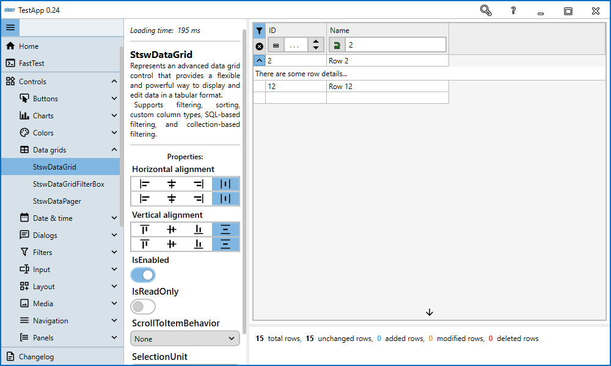
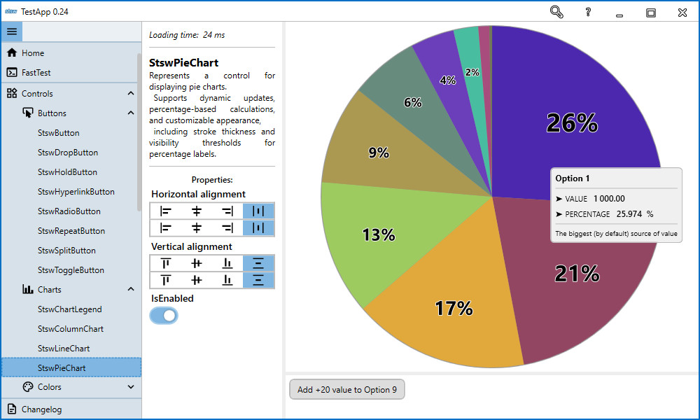
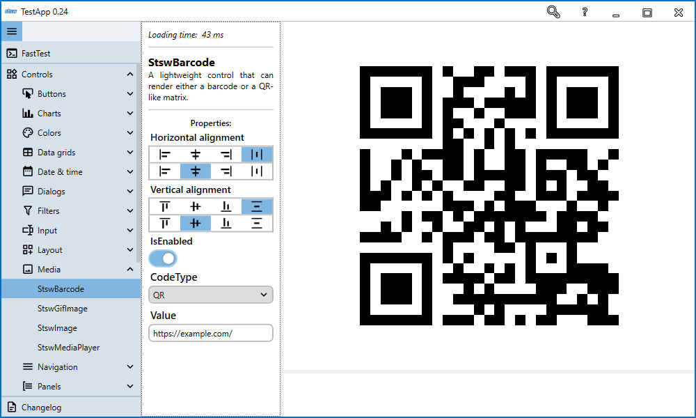

# StswExpress

**StswExpress** is a modular .NET toolkit for desktop application development. It combines reusable core utilities, SQL helpers, a large WPF control library, optional WPF themes, and Roslyn analyzers/source generators.

The packages are independent enough to let you install only the parts your application needs.

## Packages

### StswExpress.Commons

Shared infrastructure and general-purpose utilities, including:

- observable objects and collections,
- commands and task helpers,
- mapping and extension helpers,
- logging and security utilities,
- export, HTTP, localization-related support types, and other reusable building blocks.

### StswExpress.Sql

SQL/database helpers built around `Microsoft.Data.SqlClient`, including:

- connection helpers and database models,
- parameterized query execution,
- model mapping,
- scalar/non-query/reader helpers,
- bulk and temporary-table helpers,
- synchronous and asynchronous APIs with cancellation support.

### StswExpress.Wpf

The main WPF package, containing modern controls and WPF-specific infrastructure such as:

- advanced input and selector controls,
- `StswDataGrid` and filtering helpers,
- charts and visualization controls,
- dialogs, navigation, tabs, toasts, and tray notifications,
- theming, localization, scaling, and custom window support.

### StswExpress.Wpf.Themes

Optional additional themes for `StswExpress.Wpf`.

### StswExpress.Analyzers

Roslyn analyzers and source generators used by StswExpress projects, including generated observable properties and command-related helpers.

---

## Highlights

### Advanced `StswDataGrid`

`StswDataGrid` extends the standard WPF grid with custom columns, filter controls, row-state integration, row details, and both collection-view and SQL-oriented filtering workflows.



### Charts and visualization

The WPF package includes charting and visualization controls such as `StswColumnChart`, `StswLineChart`, `StswPieChart`, calendars, timelines, progress controls, and more.



### Barcode and QR support

`StswBarcode` supports common barcode formats including QR codes.



### Dialogs, tabs, toasts, and navigation

Identifier-based controls make it possible to address loaded UI hosts without tightly coupling the caller to a specific control instance. This pattern is used by controls such as `StswContentDialog`, `StswNavigation`, `StswTabControl`, `StswNotifyIcon`, and `StswToaster`.


### Themes and localization

StswExpress includes light/dark theme support, runtime theme switching, translation helpers, runtime language switching, and an optional package with additional WPF themes.

---

## Getting started

For a WPF application, start with:

```bash
dotnet add package StswExpress.Wpf
```

For SQL helpers, install:

```bash
dotnet add package StswExpress.Sql
```

Then continue with:

- [Getting started](articles/getting-started.md)
- [Installation](articles/installation.md)
- [Startup tutorial](articles/tutorials/startup.md)
- [Database helpers tutorial](articles/tutorials/database-helpers.md)
- [StswDataGrid tutorial](articles/tutorials/data-grid.md)
- [Identifier-based controls](articles/tutorials/identifier-controls.md)
- [Changelog](articles/changelog/index.md)
- [API Reference](api/index.md)

## API Reference

The API reference is generated automatically by DocFX from the current source projects. It is rebuilt together with the documentation whenever the GitHub Pages workflow runs.

## Versioning

StswExpress uses semantic versioning-style package versions:

- `MAJOR` for breaking changes,
- `MINOR` for new backwards-compatible functionality,
- `PATCH` for fixes.

See the [changelog](articles/changelog/index.md) for release history.

## Support and feedback

If something is unclear or you find a bug, check the API reference and changelog first, then open an issue in the GitHub repository.

## License

StswExpress is distributed under the MIT License. See the repository `LICENSE` file for details.
